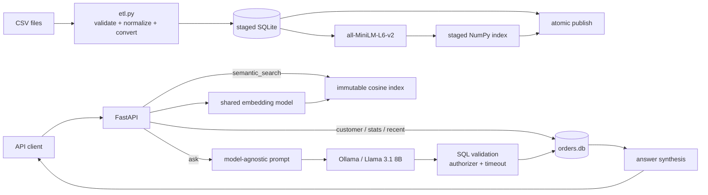
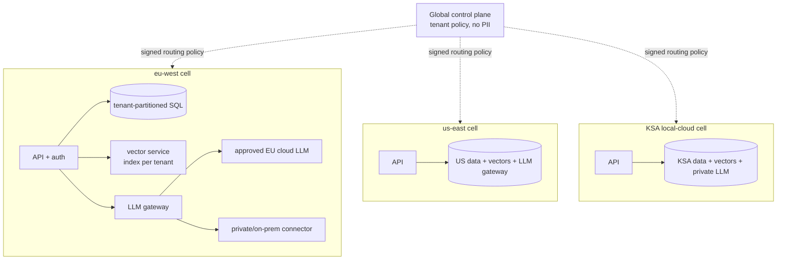
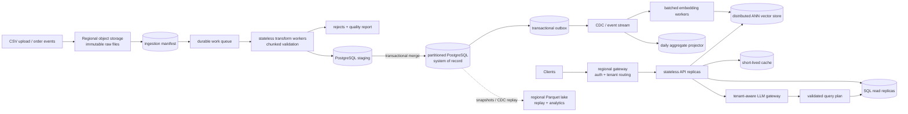

# Customer Orders ETL and AI Query Service

An end-to-end AI Architect solution for `sap-cxii-tech-ex-02`: atomic CSV ETL,
SQLite query APIs, guarded natural-language-to-SQL, semantic order retrieval,
tests, a hardened multi-stage container, Kubernetes manifests, and a regional
multi-tenant design.

## Architecture



The ETL revision is stored in both artifacts. The API activates only a complete,
matching index snapshot; a watcher loads or rebuilds newer revisions in a
background thread and then atomically swaps the in-memory reference.

## Quick start

Python 3.10+ is required. The first ETL run downloads the embedding model.

```bash
python3 -m venv .venv
source .venv/bin/activate
pip install -r requirements-dev.txt

# Local/private LLM provider (only /orders/ask needs it)
ollama pull llama3.1:8b

python3 etl.py load data/orders.csv
uvicorn app:app --host 0.0.0.0 --port 8000
```

OpenAPI is at `http://localhost:8000/docs`.

```bash
curl http://localhost:8000/healthz
curl http://localhost:8000/orders/stats
curl http://localhost:8000/orders/customer/AY-10555
curl 'http://localhost:8000/orders/recent?days=30'
curl 'http://localhost:8000/orders/semantic_search?q=high%20value%20recent%20orders&top_k=5'
curl -X POST http://localhost:8000/orders/ask \
  -H 'content-type: application/json' \
  -d '{"question":"What is the total revenue from customer AY-10555?"}'
```

The supplied data currently produces 5,009 extracted rows, 4,948 loaded orders,
61 quarantined rows, and 55 amounts defaulted to zero. Generated `.db` and `.npz`
files are intentionally ignored by Git.

## ETL behavior

```bash
# One or many files; a directory loads all of its *.csv files
python3 etl.py load data/orders.csv another.csv

# Debug/test escape hatch; normal loads always rebuild the index
python3 etl.py load data/orders.csv --skip-index

python3 etl.py show-stats
```

The load contract is:

| Input condition | Result |
|---|---|
| `YYYY-MM-DD`, `YYYY/MM/DD`, `MM/DD/YYYY` | normalized to `YYYY-MM-DD` |
| day-first hyphen dates in the supplied file | normalized to `YYYY-MM-DD` |
| missing or non-numeric amount | `0.00` |
| EUR amount | multiplied by `1.1`, rounded half-up to cents |
| missing currency | USD |
| missing order/customer ID, invalid date, unsupported currency | quarantined in `etl_rejects` |
| duplicate order ID across inputs | later occurrence wins |

The cleaned schema is deliberately small:

```sql
CREATE TABLE orders (
  order_id TEXT PRIMARY KEY NOT NULL,
  customer_id TEXT NOT NULL,
  order_date TEXT NOT NULL,
  amount_usd REAL NOT NULL
);
```

ETL builds the database and semantic index under temporary names. It publishes
them with `os.replace`, so a failed parse or embedding run preserves the last
valid artifacts. `etl_metadata` contains a UUID revision and load counters;
invalid rows retain their source file, line, reason, and payload for audit.

## API contract

| Method and path | Behavior |
|---|---|
| `GET /orders/customer/{customer_id}` | all matching orders, newest first |
| `GET /orders/stats` | revenue, average value, and order count per day |
| `GET /orders/recent?days=N` | orders in the inclusive UTC-calendar window ending today |
| `POST /orders/ask` | guarded NL→SQL result, answer, SQL, rows, truncation flag |
| `GET /orders/semantic_search?q=...&top_k=5` | cosine-nearest order records |
| `GET /healthz` | liveness; JSON string `"ok"` |
| `GET /readyz` | database/index readiness and active revision |

Parameters are bounded (`days` 1–36,500, `top_k` 1–50); NL SQL results are
capped at 200 rows. A historical dataset may legitimately return no “recent”
orders because the anchor is SQLite `date('now')`, not the maximum date in the
file.

## Natural-language query layer

### Provider and model

The default is **Ollama with `llama3.1:8b`**. It needs no API key, can run in the
same residency boundary as the order database, exposes deterministic JSON mode,
and is capable enough for this four-column schema. The choice trades cloud-model
quality and elasticity for privacy, predictable marginal cost, and offline
operation. Ollama's documented `/api/chat` contract supplies JSON formatting and
the `prompt_eval_count`/`eval_count` fields used here for token logging
([Ollama chat API](https://docs.ollama.com/api/chat)).

`LLMClient` isolates provider transport from prompting and execution. Replacing
`OllamaClient` with a cloud or private gateway adapter does not change SQL policy.

### System prompt template

This is the exact SQL-writer template in `sql_query.py`; `{schema}` is populated
with the column names, SQLite types, and meanings shown above.

```text
You translate user questions into safe SQLite SELECT queries.

Available database schema:
{schema}

Rules:
1. Use only the columns and table shown above.
2. Produce exactly one read-only SELECT statement (a WITH ... SELECT is allowed).
3. Never use INSERT, UPDATE, DELETE, DDL, PRAGMA, ATTACH, or comments.
4. For "recent" or "last N days", compare order_date with date('now', '-N days').
5. Use amount_usd for all money calculations and round monetary aggregates to 2 decimals.
6. If the question requires unavailable fields or cannot be answered from this schema,
   set answerable to false and explain the missing information.
7. Return JSON only, in exactly one of these shapes:
   {"answerable": true, "sql": "SELECT ...", "reason": null}
   {"answerable": false, "sql": null, "reason": "..."}
```

The generated SQL passes through defense in depth: one statement only,
`SELECT`/`WITH` only, keyword and comment rejection, a read-only SQLite URI,
`PRAGMA query_only`, an authorizer restricted to `orders` and a safe function
allowlist, a progress-handler deadline, and a response-row cap. Therefore the
LLM is a planner, never a database authority.

Each attempt logs a request ID, full prompt, generated SQL, and provider token
count. Production deployments should route these structured logs through PII
redaction and access-controlled retention; full prompt logging exists here
because it is an exercise requirement.

### Explicit retry trace

The automated `test_invalid_sql_retries_once_with_error` exercises the required
repair path:

```text
Question: revenue?
Attempt 1 SQL: SELECT total FROM orders
SQLite error: no such column: total
Repair prompt addition: The previous SQL failed with this error:
                        no such column: total
Attempt 2 SQL: SELECT ROUND(SUM(amount_usd), 2) AS total_revenue FROM orders
Answer: Total revenue: $11.00 (1 order)
```

There is exactly one repair attempt. A schema-mismatch declaration or two failed
attempts returns `400`; provider failure returns `503`. After successful SQL, a
second LLM call writes a concise answer. If only that summarization call fails,
the service preserves the successful rows/SQL and returns a deterministic count.

## Semantic search

Each record becomes `order <id>; customer <id>; amount <x> USD; order date
<date>`. `sentence-transformers/all-MiniLM-L6-v2` was chosen because it is a
compact 22.7M-parameter encoder intended for sentences and short paragraphs,
emits 384-dimensional vectors, and explicitly supports semantic search
([model card](https://huggingface.co/sentence-transformers/all-MiniLM-L6-v2)).
Both record and query vectors are normalized, so a matrix dot product is cosine
similarity.

The `.npz` index contains normalized vectors plus immutable order metadata. This
keeps an in-flight search internally consistent even while ETL publishes a newer
database. ETL always creates a matching staged index. On startup, the service
loads it or synchronously rebuilds before readiness; after startup, revision
polling performs work off the request loop and atomically swaps the complete
snapshot. Existing requests continue using the prior snapshot.

Exact NumPy search is `O(ND)`: simple, portable, and appropriate for 5,000 rows,
but memory and latency grow linearly. At millions of orders I would move the same
embedding contract to a regional vector service/FAISS-HNSW index and measure
recall against this exact implementation. Semantic similarity is not a numeric
predicate; questions such as “amount over $1,000” belong on `/orders/ask`.

## Test and deploy

```bash
python3 -m pytest -q
# 7 passed

docker build -t orders-api:latest .
docker run --rm -p 8000:8000 \
  --add-host host.docker.internal:host-gateway \
  -e LLM_BASE_URL=http://host.docker.internal:11434 \
  orders-api:latest
```

The Docker build uses builder/runtime stages, downloads model weights and builds
seed artifacts once, runs as UID/GID 10001, has no runtime model-download
dependency, and includes a healthcheck. The runtime image uses one Uvicorn worker
to avoid duplicating the model and because local SQLite is the scaling boundary.

Kubernetes resources include a ConfigMap, single-replica Deployment, startup/
readiness/liveness probes, ClusterIP Service, and RWO PVC. The init container
seeds a new volume. Change the image to an immutable registry digest and provide
an Ollama Service named `ollama` before applying:

```bash
kubectl apply -f k8s/configmap.yaml
kubectl apply -f k8s/pvc.yaml
kubectl apply -f k8s/deployment.yaml
kubectl apply -f k8s/service.yaml
```

## Configuration

| Variable | Default | Purpose |
|---|---|---|
| `DB_PATH` | `data/orders.db` | SQLite artifact |
| `SEMANTIC_INDEX_PATH` | `data/orders-index.npz` | vector snapshot |
| `EMBEDDING_MODEL` | `sentence-transformers/all-MiniLM-L6-v2` | embedding model |
| `EMBEDDING_CACHE_DIR` | library default | downloaded weights |
| `INDEX_POLL_SECONDS` | `5` | ETL revision detection interval |
| `LLM_BASE_URL` | `http://localhost:11434` | Ollama/private endpoint |
| `LLM_MODEL` | `llama3.1:8b` | SQL and answer model |
| `LLM_TIMEOUT_SECONDS` | `45` | provider deadline |
| `SQL_TIMEOUT_SECONDS` | `2` | generated-query deadline |
| `LOG_LEVEL` | `INFO` | service log level |

## Part 4d — regional multi-tenant extension (≤ 1 page)

I would deploy three independent **regional data-plane cells**: EU in `eu-west`,
US in `us-east`, and KSA on the approved local cloud. A global control plane may
hold tenant-to-cell routing and model policy, but never order data, prompts,
embeddings, or customer identifiers. Identity tokens carry a signed tenant ID;
the regional gateway derives scope from that claim, never from a request field.



**1. Vector isolation.** I choose one physical index per tenant, encrypted with a
tenant key and stored only in its assigned region. A shared FAISS index plus
post-search namespace filtering can leak through implementation errors, timing,
or incorrect over-fetching, and filtered recall/latency becomes data-distribution
dependent. Separate indexes give a small blast radius, safe deletion, per-tenant
rebuilds, and predictable authorization. The accepted cost is per-index metadata,
more files/connections, and poor utilization for small tenants. The embedding
model remains shared; indexes are lazy-loaded with an LRU memory budget, while
large/hot tenants receive dedicated shards.

**2. LLM routing.** A regional LLM gateway sits after authentication and before
provider transport. It resolves `(tenant, data-classification, task)` against a
policy registry: approved regional cloud endpoint, a private Llama/Ollama
deployment, or deny. The prompt layer emits a provider-neutral task containing
role messages, JSON output schema, database dialect, and retry context. Thin
adapters translate that object into each provider API and normalize text, token
usage, errors, and timeouts. Model capability/version is pinned per tenant and
evaluated with a golden NL→SQL suite before promotion.

**3. PII guardrails.** The LLM sees only the allowlisted logical schema and the
question—not database samples—and generated SQL executes inside the tenant's
regional cell with row-level tenant enforcement independent of the SQL text.
Before inference: authenticate/authorize, rate-limit, classify and DLP-scan the
question, tokenize recognizable customer IDs, reject prompt injection/data
exfiltration intent, and attach a policy decision ID. After inference: parse
structured output, enforce the read-only SQL AST/table/column allowlist, apply
cost/time/row limits, redact logs, and audit hashes plus token counts. Encryption,
tenant keys, short retention, and no-training/no-retention provider terms are
mandatory. For third-party cloud models I would not send result rows for answer
synthesis—use deterministic templates or aggregates after detokenization inside
the cell. An on-prem model may receive authorized minimal rows, but the same DLP,
least-privilege, evaluation, and audit controls remain because model compromise
is still in scope.

**4. Highest-leverage decision.** Regional cells plus per-tenant vector indexes
make residency and isolation structural properties instead of filters developers
must remember. I accept higher memory and operational cost, some duplicated
infrastructure, and less flexible cross-region failover. For enterprise order
data, reducing cross-tenant leakage and residency blast radius is worth that
efficiency loss; autoscaling shared stateless APIs and embedding workers recovers
most utilization without weakening the data boundary.

## Scaling to millions of records — re-architecture

Record count alone is not the scaling signal: ingest rate, tenant skew, query
shape, freshness SLO, and embedding dimension matter more. I would keep the
current design for small installations, move to the architecture below when a
single-node load test no longer meets its SLO, and avoid introducing Spark or a
message broker merely because the dataset crossed an arbitrary row count.

### Target architecture



The important ownership rule is: **PostgreSQL is authoritative; the vector
index, aggregates, cache, and analytical lake are derived projections.** Each
projection carries an order version and source-event offset, so it can be
replayed, compared, or rebuilt without guessing which copy won.

### Component changes

| Current component | Million-record replacement | Reason |
|---|---|---|
| CSV read in one process | upload API/object notification → manifest → queued job | retries and backpressure do not tie up an API process |
| temporary SQLite file | regional HA PostgreSQL, staging tables, bulk `COPY`, transactional merge | concurrent writers/readers, recovery, replicas, operational tooling |
| whole-dataset rebuild | chunked/incremental transform with file checksum and checkpoint | bounded memory and resumable failure recovery |
| in-process NumPy scan | replicated ANN store using HNSW and tenant-aware sharding | sublinear search and horizontal capacity |
| synchronous record embedding | independently autoscaled, batched CPU/GPU workers | isolates expensive inference and absorbs bursts |
| polling a DB revision | transactional outbox + CDC stream | no lost update between the SQL commit and vector update |
| live full-table stats | incrementally maintained daily aggregates | stable latency independent of order-table size |
| one API pod | stateless replicas behind a regional load balancer | horizontal scale and rolling deployments |
| generated SQL on primary | model-generated logical plan compiled by a query gateway, executed on read replicas | protects write capacity and enforces tenant/query policy |

### Ingestion and data correctness

1. The upload service writes every source file once to encrypted regional object
   storage, calculates a checksum, and inserts an ingestion-manifest row with a
   unique `(tenant_id, checksum)` key. Returning `202 Accepted` decouples upload
   latency from transformation time.
2. Queue consumers claim a manifest, stream the CSV in bounded chunks, and reuse
   the same deterministic date/currency rules as `etl.py`. Valid rows go to a
   staging table through PostgreSQL `COPY`; rejects and quality metrics go to
   immutable object storage plus an audit table.
3. One database transaction merges staging rows into `orders` and writes an
   outbox event for every inserted, updated, or deleted order. The business
   idempotency key is `(tenant_id, order_id)`; every row also has
   `order_version`, `source_checksum`, and `ingested_at`. Retrying a chunk is
   therefore harmless.
4. A CDC connector publishes committed outbox rows. Embedding and aggregate
   consumers are at-least-once and idempotent: the vector point ID is derived
   from tenant/order ID, and an update is accepted only when its order version
   is newer. Tombstones remove deleted orders. This avoids an unsafe direct
   dual-write from an ETL worker to SQL and the vector database. The pattern is
   compatible with the documented [Debezium outbox event router](https://debezium.io/documentation/reference/stable/transformations/outbox-event-router.html).

For occasional multi-million-row files, several Python/Polars/PyArrow workers
and database bulk loading are simpler and usually sufficient. For sustained
high-volume streams, joins, or large backfills, the transform stage can move to
Spark Structured Streaming with durable checkpoints; Spark documents its
default micro-batch engine as fault-tolerant and exactly-once through
checkpointing and write-ahead logs
([Spark documentation](https://spark.apache.org/docs/latest/streaming/index.html)).
The sink still needs the idempotency keys above—framework guarantees do not
remove end-to-end application responsibilities.

### Relational serving store

Every key and index starts with `tenant_id`; the API database role is protected
by [PostgreSQL row-level security](https://www.postgresql.org/docs/current/ddl-rowsecurity.html)
in addition to application authorization. A reasonable initial layout is hash
partitioning by `tenant_id`, which preserves a unique key on `(tenant_id,
order_id)` and distributes skew better than one table per customer. Required
constraints/indexes are:

```sql
PRIMARY KEY (tenant_id, order_id);
CREATE INDEX orders_customer_date_idx
  ON orders (tenant_id, customer_id, order_date DESC);
CREATE INDEX orders_tenant_date_idx
  ON orders (tenant_id, order_date DESC);
```

Very large tenants graduate to dedicated databases. If retention and long date
scans dominate, monthly range partitions become useful, with a separate order-key
registry to preserve tenant/order uniqueness across date partitions. PostgreSQL
supports range, list, and hash partitioning and can prune irrelevant partitions,
but its own guidance notes that partitioning is worthwhile only for sufficiently
large tables and must match access patterns
([PostgreSQL partitioning](https://www.postgresql.org/docs/current/ddl-partitioning.html)).

`/orders/stats` reads `daily_order_stats(tenant_id, order_date, order_count,
revenue_sum)`, updated from the change stream. Total and average are derived as
`SUM(revenue_sum)` and `SUM(revenue_sum)/SUM(order_count)`. Customer and recent
queries use the covering indexes above and read replicas. A small Redis-compatible
cache may hold tenant stats and repeated recent queries, keyed by tenant plus
aggregate watermark; correctness never depends on cache eviction.

### Vector and embedding tier

A 384-dimensional float32 embedding consumes 1,536 bytes before index overhead:
about 15.4 GB for 10 million orders and 153.6 GB for 100 million. HNSW graph
edges, payloads, allocator overhead, and replicas add materially more. Therefore
the design uses:

- a regional distributed vector cluster with at least three voting nodes and
  replicated shards for production availability;
- a tenant shard key or physical collection per tenant, consistent with the
  isolation policy in Part 4d; exceptionally large tenants get dedicated
  collections/clusters;
- minimal payload (`tenant_id`, `order_id`, `order_version`, date/amount fields
  needed for filters), with authoritative records batch-fetched from SQL;
- scalar/product quantization or float16 only after measuring recall against a
  fixed exact-search evaluation set;
- batch embedding, bounded queues, per-tenant quotas, and separate autoscaling
  from API traffic.

Qdrant is one valid implementation: it supports sharding, replication,
filterable HNSW search, and explicit read/write consistency, while documenting
that point updates do not have strong distributed transaction guarantees
([distributed deployment](https://qdrant.tech/documentation/distributed_deployment/)).
That is why SQL remains authoritative and the outbox consumer is versioned and
replayable. For the 50-tenant case, custom shard keys provide physical routing;
for much higher tenant cardinality, payload partitioning avoids unsustainable
collection overhead
([Qdrant multitenancy](https://qdrant.tech/documentation/tutorials/multiple-partitions/)).

Embedding upgrades are blue/green: write `embedding_model_version`, backfill a
new collection without mutating the live one, evaluate recall/latency, dual-read
a sample of traffic, then switch an alias. Rollback changes the alias; old
vectors expire only after the observation window.

### Query and AI path

At this scale I would stop asking the LLM for unrestricted SQL text. It produces
a typed logical plan such as:

```json
{
  "metric": "revenue_sum",
  "filters": {"customer_id": "C001", "date_window_days": 30},
  "group_by": [],
  "limit": 100
}
```

A deterministic compiler maps that plan to parameterized, allowlisted SQL and
injects `tenant_id` from the authenticated identity. The LLM cannot name a table,
join, function, or tenant. The query gateway rejects unknown metrics, estimates
cost with `EXPLAIN`, enforces statement/lock timeouts, scanned-row and result
limits, workload concurrency, and a read-only transaction. Heavy exports become
asynchronous jobs against the analytical store rather than long HTTP requests.

Answer synthesis receives aggregates or a small redacted result, never millions
of raw rows. Cache keys include tenant, normalized plan, schema/metric version,
and data watermark. Prompt, model, policy, SQL-plan hash, latency, retry, and token
metrics are trace-correlated without logging raw PII.

Semantic queries apply tenant/date/currency payload filters inside the vector
engine before ANN traversal, retrieve more candidates than requested, optionally
rerank a small set, and then batch-fetch current records from SQL. A returned
vector version older than the SQL row is dropped. Numeric predicates remain
structured filters; they are not entrusted to embedding similarity.

### Consistency and failure contract

PostgreSQL is the strongly consistent authority. Endpoints requiring
read-after-write route to the primary or wait until a replica has replayed the
required log position; ordinary reads may opt into explicitly bounded replica
staleness. Semantic search and precomputed aggregates are eventually consistent.
Each response can expose `data_watermark` and `index_watermark`; an
`index_lag_seconds` metric drives alerts. If a caller requests a minimum version,
the API waits briefly, falls back to relational search where possible, or returns
`409/503` with retry guidance—it never silently claims freshness.

Failure handling is designed around replay:

- manifest leases expire so another worker resumes a failed file;
- bad chunks enter a dead-letter queue with source/checkpoint context;
- database commit succeeds or rolls back with its outbox rows;
- CDC offsets and consumer checkpoints live in durable regional storage;
- vector and aggregate projections rebuild from the SQL snapshot plus retained
  event log;
- backups, replicas, keys, and disaster recovery remain inside the tenant's
  allowed residency boundary.

Backpressure pauses file claims or CDC consumption before memory is exhausted.
Ingestion may remain accepted while embeddings lag, within a documented
freshness SLO; it must not overload the transactional store to make the vector
index appear current.

### Capacity, SLOs, and observability

These are starting decision bands, not promises; load tests with the actual
tenant/date distribution determine the cutovers.

| Operating band | Default topology |
|---|---|
| up to roughly 1–10M regional orders, moderate batch ingest | HA PostgreSQL, object storage, queued Python workers, small replicated vector cluster |
| roughly 10–100M or sustained concurrent ingest | SQL partitioning/read replicas, CDC stream, separately autoscaled embedding fleet, sharded vector cluster |
| 100M+, long analytical scans, or high-rate event streams | lakehouse/columnar analytics and distributed transform; PostgreSQL retains hot serving data and authoritative keys |

Example objectives to validate are p95 `<250 ms` for indexed customer/recent
queries, p95 `<350 ms` for semantic search excluding external LLM time, stats
`<200 ms` from aggregates, and p99 vector freshness `<5 minutes`. Dashboards and
alerts cover:

- file/chunk throughput, validation rate, duplicate rate, and dead-letter count;
- queue age, CDC offset lag, embedding throughput, index watermark, and rebuild
  progress;
- DB pool saturation, replica lag, rows scanned, slow queries, cache hit rate,
  partition skew, and storage growth;
- vector p50/p95/p99 latency, filtered-candidate count, recall@k on a labelled
  evaluation set, memory per vector, and tenant/noisy-neighbor skew;
- LLM latency, timeouts, invalid-plan rate, repair rate, token/cost budgets, and
  answer-quality regression by model/prompt version;
- end-to-end traces carrying `tenant_id` as an access-controlled hash,
  `ingestion_id`, `order_version`, and correlation ID.

### Migration without a big-bang rewrite

1. Add `tenant_id`, `order_version`, repository interfaces, and contract tests to
   the current service. Move SQLite to PostgreSQL while retaining the API.
2. Put uploads in object storage and run the existing transformation logic in a
   queued worker. Dual-read sampled results and reconcile counts/revenue before
   making PostgreSQL authoritative.
3. Add the transactional outbox, backfill the vector service from a consistent
   SQL snapshot, then consume changes from the snapshot watermark. Shadow
   semantic requests and compare top-k/latency before cutover.
4. Introduce daily aggregate projection, read replicas, cache, and multiple
   stateless API replicas. Load-test tenant skew and failure recovery.
5. Add distributed streaming/analytical infrastructure only when observed
   throughput, retention, or query SLOs justify its cost.

This sequence keeps every transition reversible and maintains one explicit
source of truth throughout the migration.

## Deliberate scope boundaries

The optional LangGraph bonus is not included; the explicit two-attempt loop is
smaller and directly testable. Authentication, a production vector database,
regional SQL, Ollama deployment, model evaluation, and telemetry backends belong
to the extension above rather than this single-process exercise.
